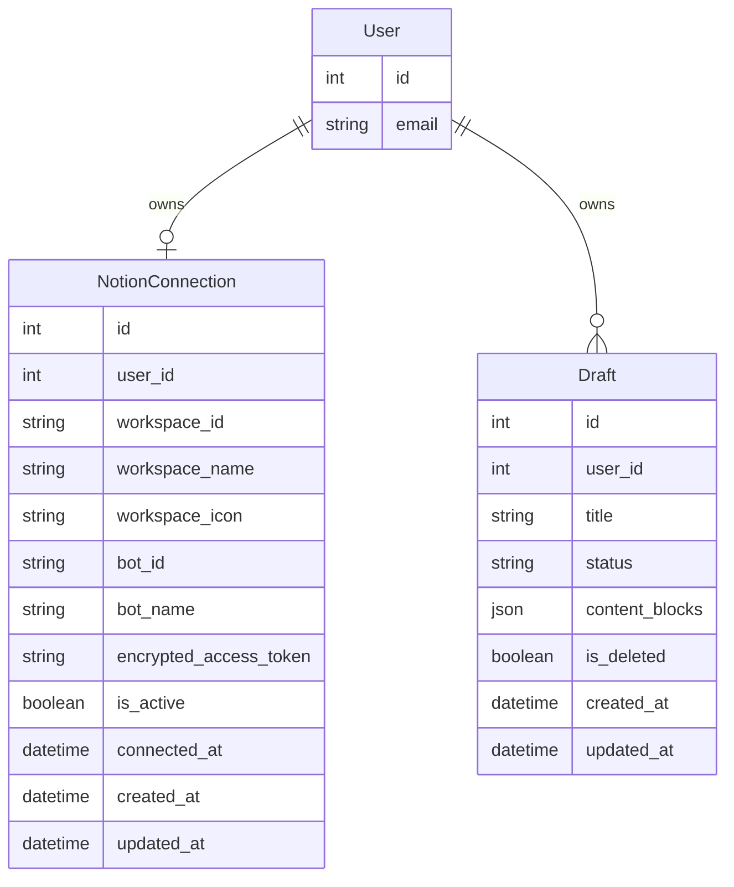
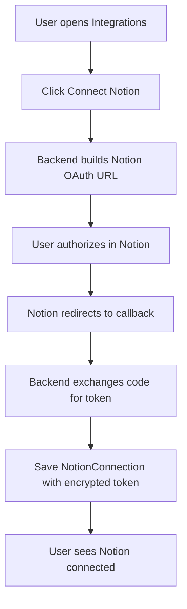
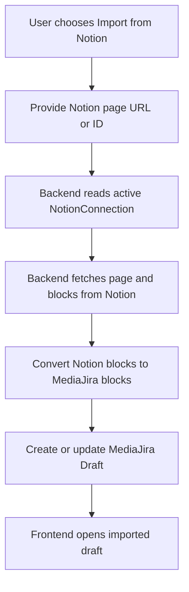
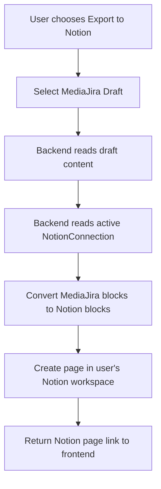

# Notion Integration Step 1-2 Design

## Step 1: Data Model

This step only defines what the backend needs to store for a user's Notion workspace connection. It does not add a persistent relationship between external Notion pages and MediaJira drafts yet.

### `NotionConnection`

Stored in `backend/notion_editor/models.py`.

| Field                       | Purpose                                                            |
| --------------------------- | ------------------------------------------------------------------ |
| `user`                      | One-to-one owner of the Notion workspace connection.               |
| `workspace_id`              | Notion workspace identifier returned by OAuth.                     |
| `workspace_name`            | Human-readable workspace name for display.                         |
| `workspace_icon`            | Optional workspace icon URL.                                       |
| `bot_id`                    | Notion integration/bot user ID when available.                     |
| `bot_name`                  | Bot display name or email when available.                          |
| `encrypted_access_token`    | Encrypted Notion access token. The raw token must never be stored. |
| `is_active`                 | Whether the connection is currently usable.                        |
| `connected_at`              | Timestamp when the connection became active.                       |
| `created_at` / `updated_at` | Standard audit timestamps.                                         |

### Deferred Model

Do not add `NotionPageLink` in this step. Import/export can be treated as one-time actions first. A future sync or webhook ticket can introduce a link table with fields such as `draft_id`, `external_page_id`, `direction`, and `last_synced_at`.

## Step 2: ERD

Key points for review:

- `User` to `NotionConnection` is one-to-zero-or-one: a user may have no Notion connection or one active workspace connection.
- `Draft` remains the internal MediaJira document model.
- There is no direct database relationship between `Draft` and an external Notion page in this step.

## Connect Flow

## Import Flow

This is a future flow for the next implementation step. The current design does not persist an external page to draft relationship.

## Export Flow

This is a future flow for the next implementation step. The current design does not store the exported Notion page ID.

